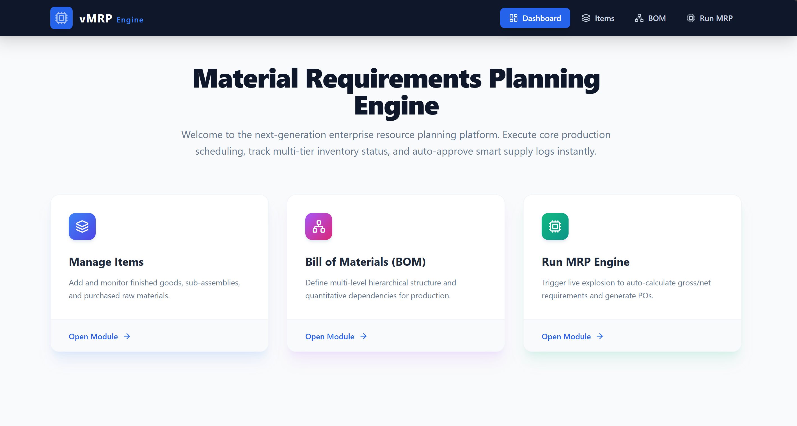
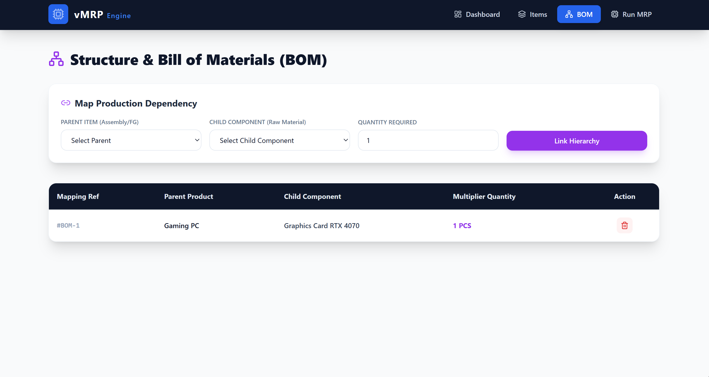
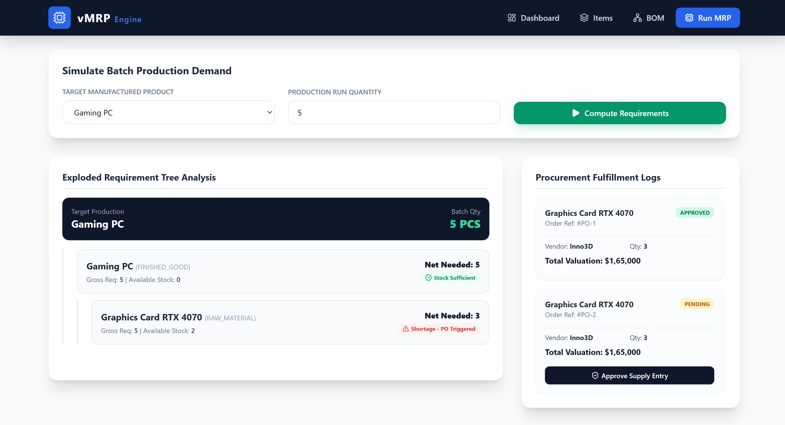

# 🏭 MRP Engine — Enterprise Material Requirements Planning System


> A full-stack **Enterprise Material Requirements Planning (MRP) Engine** built with **Spring Boot** and **React.js**. It manages multi-level hierarchical Bills of Materials (BOM), calculates raw material demand using a recursive explosion algorithm, and auto-generates Purchase Orders to prevent factory stockouts.

---

## 📸 Screenshots

| Dashboard | BOM Tree | Purchase Orders |
|-----------|----------|-----------------|
|  |  |  |

---

## 📋 Table of Contents

- [Features](#-features)
- [Tech Stack](#-tech-stack)
- [Project Structure](#-project-structure)
- [Getting Started](#-getting-started)
- [API Endpoints](#-api-endpoints)
- [How MRP Works](#-how-mrp-works)
- [Database Schema](#-database-schema)
- [Contributing](#-contributing)

---

## ✨ Features

- 🔁 **Recursive BOM Explosion Algorithm** — traverses multi-level Bill of Materials tree using Depth-First Search
- 📦 **Inventory Integration** — calculates Gross Requirements minus On-Hand stock to get Net Requirements
- 🛒 **Auto Purchase Order Generation** — automatically creates POs for items with shortages
- ✅ **PO Approval Workflow** — Procurement Manager can approve/reject generated Purchase Orders
- 🌳 **Interactive BOM Tree** — visual hierarchical tree with expand/collapse in React
- 🔒 **Circular BOM Detection** — prevents infinite recursion in circular BOM structures
- 📊 **Cost Estimation** — calculates total estimated procurement cost per MRP run
- 🗄️ **Full CRUD APIs** — manage Items, BOM Links, and Inventory via REST APIs

---

## 🛠 Tech Stack

### Backend
| Technology | Version | Purpose |
|------------|---------|----------|
| Java | 17 | Core language |
| Spring Boot | 3.2.0 | Backend framework |
| Spring Data JPA | 3.2.0 | ORM & database access |
| Spring Validation | 3.2.0 | Request validation |
| MySQL | 8.0 | Relational database |
| Lombok | Latest | Boilerplate reduction |
| Maven | 3.x | Build tool |

### Frontend
| Technology | Version | Purpose |
|------------|---------|----------|
| React.js | 18.2.0 | UI framework |
| React Router DOM | 6.20.0 | Client-side routing |
| Axios | 1.6.0 | HTTP client (API calls) |
| React Scripts | 5.0.1 | Build tooling |

---

## 📁 Project Structure

```
mrp-engine/
│
├── 📂 src/main/java/com/mrp/mrpengine/
│   ├── 📄 MrpEngineApplication.java        # Spring Boot entry point
│   │
│   ├── 📂 entity/
│   │   ├── 📄 Item.java                    # Item entity (Finished Good / Sub-Assembly / Raw Material)
│   │   ├── 📄 BomLink.java                 # BOM junction table (parent → child + qty)
│   │   ├── 📄 InventoryStatus.java         # On-hand stock per item
│   │   └── 📄 PurchaseOrder.java           # Auto-generated purchase orders
│   │
│   ├── 📂 repository/
│   │   ├── 📄 ItemRepository.java
│   │   ├── 📄 BomLinkRepository.java
│   │   ├── 📄 InventoryStatusRepository.java
│   │   └── 📄 PurchaseOrderRepository.java
│   │
│   ├── 📂 dto/
│   │   ├── 📄 ItemDTO.java
│   │   ├── 📄 BomLinkDTO.java
│   │   ├── 📄 BomExplosionNode.java         # Single node in BOM tree result
│   │   ├── 📄 MrpResultDTO.java             # Full MRP result
│   │   └── 📄 PurchaseOrderDTO.java
│   │
│   ├── 📂 service/
│   │   ├── 📄 ItemService.java
│   │   ├── 📄 BomLinkService.java
│   │   └── 📄 MrpService.java              # ⭐ Core recursive BOM explosion algorithm
│   │
│   ├── 📂 controller/
│   │   ├── 📄 ItemController.java
│   │   ├── 📄 BomLinkController.java
│   │   └── 📄 MrpController.java
│   │
│   └── 📂 exception/
│       └── 📄 GlobalExceptionHandler.java
│
├── 📂 src/main/resources/
│   └── 📄 application.properties
│
├── 📂 frontend/
│   ├── 📄 package.json
│   ├── 📂 public/
│   │   └── 📄 index.html
│   └── 📂 src/
│       ├── 📄 index.js
│       ├── 📄 App.js
│       ├── 📂 api/
│       │   └── 📄 api.js                   # Axios API calls
│       ├── 📂 components/
│       │   ├── 📄 Navbar.js
│       │   ├── 📄 BomTreeNode.js            # Recursive BOM tree component
│       │   └── 📄 PurchaseOrderCard.js
│       └── 📂 pages/
│           ├── 📄 Dashboard.js
│           ├── 📄 ItemsPage.js
│           ├── 📄 BomPage.js
│           └── 📄 MrpPage.js               # ⭐ Main MRP run page
│
└── 📄 pom.xml
```

---

## 🚀 Getting Started

### Prerequisites

Make sure you have the following installed:

- ✅ [Java 17+](https://adoptium.net/)
- ✅ [Maven 3.x](https://maven.apache.org/)
- ✅ [MySQL 8.0+](https://dev.mysql.com/downloads/)
- ✅ [Node.js 18+](https://nodejs.org/)
- ✅ [IntelliJ IDEA](https://www.jetbrains.com/idea/) (for backend)
- ✅ [VS Code](https://code.visualstudio.com/) (for frontend)

---

### 🗄️ Step 1 — Setup MySQL Database

```sql
CREATE DATABASE mrp_db;
```

> Spring Boot will **auto-create all tables** on first run via `spring.jpa.hibernate.ddl-auto=update`

---

### ⚙️ Step 2 — Configure Backend

Open `src/main/resources/application.properties` and update your credentials:

```properties
spring.datasource.url=jdbc:mysql://localhost:3306/mrp_db?createDatabaseIfNotExist=true&useSSL=false&serverTimezone=UTC
spring.datasource.username=root
spring.datasource.password=YOUR_MYSQL_PASSWORD
```

---

### 🖥️ Step 3 — Run Backend in IntelliJ IDEA

```bash
# Option 1: Using Maven
mvn spring-boot:run

# Option 2: Open IntelliJ → Run MrpEngineApplication.java
```

✅ Backend starts at: **`http://localhost:8080`**

---

### 🌐 Step 4 — Run Frontend in VS Code

```bash
cd frontend
npm install
npm start
```

✅ Frontend starts at: **`http://localhost:3000`**

---

### 🔗 How Frontend Connects to Backend

Axios is pre-configured in `frontend/src/api/api.js`:

```js
const API = axios.create({ baseURL: 'http://localhost:8080/api' });
```

CORS is enabled on all controllers:

```java
@CrossOrigin(origins = "http://localhost:3000")
```

> No extra configuration needed — just run both servers! ✅

---

## 📡 API Endpoints

### Items API
| Method | Endpoint | Description |
|--------|----------|-------------|
| `GET` | `/api/items` | Get all items |
| `GET` | `/api/items/{id}` | Get item by ID |
| `GET` | `/api/items/type/{type}` | Get items by type |
| `POST` | `/api/items` | Create new item |
| `PUT` | `/api/items/{id}` | Update item |
| `DELETE` | `/api/items/{id}` | Delete item |

### BOM Links API
| Method | Endpoint | Description |
|--------|----------|-------------|
| `GET` | `/api/bom` | Get all BOM links |
| `GET` | `/api/bom/children/{parentId}` | Get children of a parent |
| `POST` | `/api/bom` | Create BOM link |
| `PUT` | `/api/bom/{id}` | Update BOM link |
| `DELETE` | `/api/bom/{id}` | Delete BOM link |

### MRP API
| Method | Endpoint | Description |
|--------|----------|-------------|
| `POST` | `/api/mrp/explode?productId=1&quantity=500` | Run MRP explosion |
| `GET` | `/api/mrp/purchase-orders` | Get all purchase orders |
| `PUT` | `/api/mrp/purchase-orders/{id}/approve` | Approve a purchase order |

---

### 📬 Sample API Request

**Create an Item:**
```json
POST /api/items
{
  "name": "Bicycle",
  "description": "Finished product",
  "type": "FINISHED_GOOD",
  "unitOfMeasure": "pcs",
  "onHandQuantity": 10,
  "reorderPoint": 5,
  "supplierName": "BikeWorld",
  "unitCost": 250.00
}
```

**Run MRP Explosion:**
```
POST /api/mrp/explode?productId=1&quantity=500
```

**Sample Response:**
```json
{
  "productId": 1,
  "productName": "Bicycle",
  "targetQuantity": 500,
  "bomTree": {
    "itemName": "Bicycle",
    "grossRequirement": 500,
    "onHandQuantity": 10,
    "netRequirement": 490,
    "children": [
      {
        "itemName": "Wheel",
        "grossRequirement": 1000,
        "onHandQuantity": 200,
        "netRequirement": 800,
        "children": [
          {
            "itemName": "Spokes",
            "grossRequirement": 28000,
            "onHandQuantity": 5000,
            "netRequirement": 23000,
            "needsPurchaseOrder": true
          }
        ]
      }
    ]
  },
  "purchaseOrders": [...],
  "totalEstimatedCost": 45600.00
}
```

---

## 🧠 How MRP Works

```
Production Order: 500 Bicycles
│
├── Bicycle (x500)
│   ├── Wheel (x2 each = 1000 total)
│   │   ├── Spokes (x28 each = 28,000 total)
│   │   │   └── On-Hand: 5,000 → NET REQUIREMENT: 23,000 ⚠️ PO Generated
│   │   └── Tire (x1 each = 1,000 total)
│   │       └── On-Hand: 300 → NET REQUIREMENT: 700 ⚠️ PO Generated
│   └── Frame (x1 each = 500 total)
│       └── Aluminum Tubing (x3m each = 1,500m total)
│           └── On-Hand: 200m → NET REQUIREMENT: 1,300m ⚠️ PO Generated
```

### Algorithm Steps:
1. 📥 Accept `productId` and `targetQuantity`
2. 🔁 Recursively traverse BOM tree (Depth-First Search)
3. ✖️ Multiply quantities down each level
4. ➖ Subtract on-hand inventory at leaf nodes
5. 📋 Generate Purchase Orders for all shortages
6. 💰 Calculate total estimated procurement cost

---


---

## 👥 User Personas

| Persona | Role | What They Do |
|---------|------|--------------|
| 🏭 **Production Planner** | Enters production orders | Inputs `Product + Quantity` → views raw material requirements |
| 📦 **Procurement Manager** | Approves purchase orders | Reviews MRP output → approves auto-generated POs |

---

## 🤝 Contributing

1. Fork the repository
2. Create your feature branch: `git checkout -b feature/amazing-feature`
3. Commit your changes: `git commit -m 'feat: add amazing feature'`
4. Push to the branch: `git push origin feature/amazing-feature`
5. Open a Pull Request

---


## 👨‍💻 Author

Built with ❤️ as part of an Enterprise Manufacturing Internship Project.

> *"Automate production planning. Eliminate stockouts. Optimize procurement.
Copyright © 2026 Varun Kumar. All rights reserved."*

---
